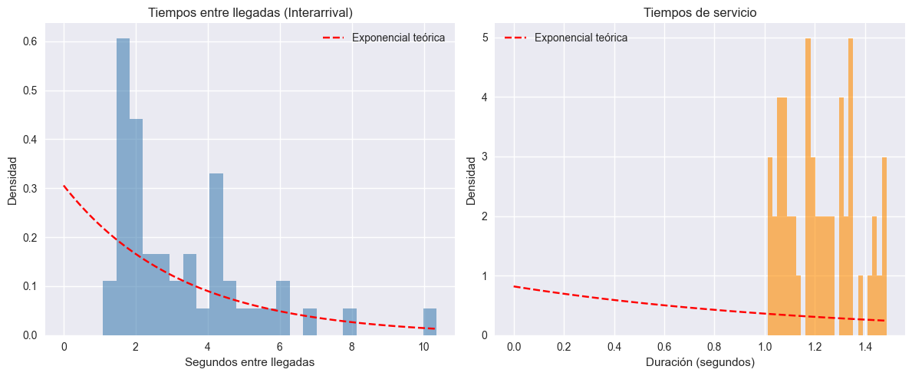

<script type="text/javascript"
  src="https://cdn.jsdelivr.net/npm/mathjax@3/es5/tex-mml-chtml.js" >
</script>
<div align="center">

# **Universidad Mayor de San Andrés**  
## **Facultad de Ciencias Puras y Naturales**  
### **Carrera de Informática**


<h1>Proyecto N°3 – Modelado y Simulación de un Sistema de Colas M/M/1 Aplicado al Tráfico en un Servidor Flask</h1>

**Integrantes:**  
- Flores Tapia Ruddy – carnet
- Cayllagua Mamani Franklin – carnet
- Salinas Condori Ian Ezequiel – 13694034
- Maximiliano Gómez Mallo – 14480221  
<br>

**Materia:** Procesos Estocásticos y Series de Tiempo
**Docente:** Ph.D. Willy Ernesto Portugal Duran
<br>

**Fecha:** [dd/mm/aaaa]

</div>

<div style="page-break-after: always;"></div>
---

## 1. Introducción
El presente proyecto tiene como finalidad analizar y modelar el comportamiento del tráfico de solicitudes en un servidor web mediante la teoría de colas, utilizando específicamente el modelo **M/M/1**. Este modelo permite representar la llegada aleatoria de solicitudes y su atención secuencial por un único servidor, lo que posibilita evaluar métricas de rendimiento como el tiempo medio de espera, la utilización del servidor y el número promedio de clientes en el sistema.

Para ello, se implementó un servidor Flask de un solo hilo, acompañado de un cliente generador de tráfico cuyas llegadas se modelan como un proceso de Poisson. El tráfico real entre cliente y servidor se registró mediante la herramienta **Wireshark**, a partir de la cual se obtuvieron datos empíricos sobre las tasas de llegada y servicio. Con estos parámetros se construyó una **simulación del sistema en SimPy**, cuyos resultados se comparan con las expresiones teóricas de la teoría de colas para el modelo **M/M/1**.

De esta manera, el proyecto integra conceptos de procesos estocásticos, teoría de colas y simulación con un escenario práctico de tráfico en un servidor Flask, permitiendo estudiar cómo la carga de trabajo impacta en su desempeño.
---

## 2. Planteamiento del problema
En los sistemas de red, el rendimiento de un servidor está determinado principalmente por la relación entre la tasa de llegada de solicitudes (λ) y la tasa de servicio (μ). Cuando la demanda de atención se aproxima o supera la capacidad del servidor, el sistema comienza a congestionarse, aumentando los tiempos de espera y afectando negativamente la calidad del servicio percibida por los usuarios.

En el caso particular de un servidor web implementado con Flask, surge la necesidad de conocer si, bajo determinadas condiciones de tráfico, su comportamiento puede describirse adecuadamente mediante un modelo de colas M/M/1, es decir, con llegadas de tipo Poisson, tiempos de servicio exponenciales y un único servidor. No disponer de este análisis dificulta la predicción del rendimiento, la identificación de posibles cuellos de botella y la toma de decisiones sobre escalabilidad o mejora de la infraestructura.

Por ello, el problema que se aborda en este proyecto es modelar y simular el tráfico de solicitudes hacia un servidor Flask en un entorno controlado, utilizando datos capturados con Wireshark, con el fin de determinar si el sistema se mantiene estable (ρ = λ/μ < 1) y si las métricas observadas se aproximan a las predichas por la teoría de colas para un sistema **M/M/1**.

---

## 3. Objetivos

**Objetivo general**

Modelar y simular el tráfico de solicitudes en un servidor Flask mediante un sistema de colas **M/M/1**, a partir de datos obtenidos con Wireshark, con el propósito de analizar su comportamiento y validar los resultados mediante una **simulación en SimPy**.

**Objetivos específicos**

- Capturar y procesar el tráfico generado entre el cliente y el servidor Flask utilizando Wireshark, exportando la información relevante a archivos CSV.
- Estimar empíricamente los parámetros λ (tasa de llegada) y μ (tasa de servicio) a partir de los datos capturados.
- Implementar en **SimPy una simulación del sistema de colas M/M/1** empleando los parámetros observados.

Comparar las métricas de rendimiento obtenidas de forma teórica, empírica y simulada, identificando y analizando las posibles diferencias.

---

## 4. Marco teórico

### 4.1. Teoría de colas

La **teoría de colas** es una rama de la probabilidad y de los procesos estocásticos que estudia sistemas en los cuales ciertas entidades (clientes, paquetes, solicitudes, tareas, etc.) llegan de manera aleatoria para ser atendidas por uno o varios servidores. Estos sistemas aparecen de forma natural en áreas como telecomunicaciones, computación, transporte, logística y servicios.

Un sistema de colas típico está determinado por:

- La **tasa de llegada** de clientes al sistema, denotada por λ.
- La **tasa de servicio**, denotada por μ, que indica la velocidad a la que el servidor atiende a los clientes.
- La **disciplina de servicio**, por ejemplo FIFO (*First In, First Out*).
- El número de **servidores** y la capacidad de la cola (finita o infinita).

A partir de estos parámetros se pueden obtener métricas como:

- **L**: número promedio de clientes en el sistema (cola + servicio).
- **Lq**: número promedio de clientes en la cola.
- **W**: tiempo promedio que un cliente pasa en el sistema.
- **Wq**: tiempo promedio que un cliente espera en la cola.

Estas cantidades permiten evaluar el rendimiento del sistema y tomar decisiones sobre dimensionamiento de recursos y calidad de servicio.

---

### 4.2. Modelo de colas M/M/1

El modelo **M/M/1** es uno de los modelos más sencillos y estudiados en teoría de colas, y sirve como punto de partida para analizar sistemas de servicio básicos. La notación **M/M/1** se interpreta de la siguiente forma:

- Primera **M** (*Markovian*): los **tiempos entre llegadas** son aleatorios y siguen una distribución exponencial, lo que equivale a decir que las llegadas se modelan mediante un **proceso de Poisson** con tasa λ.
- Segunda **M**: los **tiempos de servicio** también son exponenciales con parámetro μ.
- El número **1**: indica que existe **un solo servidor**.

Se asume, además, una cola de capacidad infinita y una disciplina de servicio **FIFO**.  
Cuando el sistema es estable:
$$ \rho = \frac{\lambda}{\mu} < 1 $$

es posible obtener expresiones analíticas para las métricas principales:

- **Número promedio de clientes en el sistema:**

$$
L = \frac{\rho}{1 - \rho}
$$


- **Número promedio de clientes en cola:**

$$
L_q = \frac{\rho^2}{1 - \rho}
$$

- **Tiempo promedio en el sistema:**
$$
W = \frac{1}{\mu - \lambda}
$$

- **Tiempo promedio en cola:**

$$
W_q = \frac{\lambda}{\mu(\mu - \lambda)}
$$

Estas relaciones permiten predecir el comportamiento del sistema en función de la carga (λ) y la capacidad de servicio (μ), y sirven como base para comparar resultados teóricos con datos empíricos y simulados.


---

### 4.3. Proceso de Poisson y tiempos exponenciales

El **proceso de Poisson** es un proceso estocástico ampliamente utilizado para modelar **llegadas aleatorias** en el tiempo, como llamadas telefónicas, llegadas de clientes a un servicio o solicitudes a un servidor web. Se caracteriza por:

- Una tasa constante de llegadas **λ**, medida en llegadas por unidad de tiempo.
- Independencia entre los incrementos: el número de llegadas en intervalos disjuntos es independiente.
- El número de llegadas en un intervalo de longitud *t* sigue una distribución de Poisson de parámetro λt.

Un resultado fundamental es que los **tiempos entre llegadas consecutivas** en un proceso de Poisson son variables aleatorias con **distribución exponencial** de parámetro λ. Es decir, si *T* representa el tiempo entre dos llegadas:

\[
T \sim \text{Exponencial}(\lambda)
\]

Del mismo modo, en muchos modelos de colas se asume que los **tiempos de servicio** también son exponenciales, con parámetro μ. Esta propiedad de “falta de memoria” de la distribución exponencial simplifica el análisis matemático y es coherente con ciertos tipos de procesos de servicio.

En el contexto de tráfico web, las llegadas de solicitudes al servidor pueden aproximarse mediante un proceso de Poisson bajo ciertas condiciones (por ejemplo, cuando hay muchos usuarios independientes generando solicitudes).

---

### 4.4. Simulación de eventos discretos y SimPy

La **simulación de eventos discretos** es una técnica que permite estudiar el comportamiento de sistemas dinámicos en los que el estado cambia en instantes específicos de tiempo, llamados **eventos** (llegadas, salidas del sistema, cambios de estado, etc.). En lugar de resolver analíticamente el modelo, se construye un **modelo computacional** que reproduce la lógica del sistema y se ejecuta múltiples veces para estimar métricas de interés.

En el caso de sistemas de colas, la simulación de eventos discretos permite:

- Modelar llegadas, tiempos de servicio y colas con alto nivel de detalle.
- Probar distintos escenarios de carga (distintos valores de λ y μ).
- Analizar el impacto de cambios en la configuración del sistema sin modificar la infraestructura real.

**SimPy** es una librería de Python diseñada específicamente para la simulación de eventos discretos. Permite definir:

- **Procesos** (por ejemplo, la generación de llegadas).
- **Recursos** (por ejemplo, un servidor que atiende solicitudes).
- **Eventos** (comienzo y finalización del servicio, llegada de nuevos clientes, etc.).

En un sistema de tipo M/M/1, SimPy puede utilizarse para simular las llegadas de solicitudes al servidor Flask, los tiempos de servicio y la dinámica de la cola, obteniendo así métricas simuladas que luego pueden compararse con las fórmulas teóricas y con los datos medidos.

---

### 4.5. Rendimiento en servidores web como sistemas de colas

Un **servidor web** puede interpretarse naturalmente como un **sistema de colas**, donde las solicitudes HTTP que llegan representan clientes que requieren servicio. Cada solicitud consume recursos de CPU, memoria y red, y si el servidor está ocupado atendiendo otras solicitudes, estas deben esperar en cola.

Algunas métricas típicas de rendimiento en servidores web son:

- **Tiempo de respuesta**: tiempo total que transcurre desde que el cliente envía una solicitud hasta que recibe la respuesta completa.
- **Tasa de llegada de solicitudes**: número de solicitudes por unidad de tiempo (λ).
- **Throughput o tasa de salida**: número de solicitudes atendidas por unidad de tiempo.
- **Utilización del servidor**: fracción del tiempo que el servidor está ocupado.

Modelar un servidor web como un sistema **M/M/1** permite relacionar estas métricas con los parámetros λ y μ, y analizar cómo se comporta el servidor cuando la carga aumenta. En particular, conforme ρ se acerca a 1, los tiempos de espera crecen rápidamente, reflejando un estado cercano a la congestión.

En este proyecto, el servidor desarrollado con **Flask** se considera como el servidor del sistema de colas, y el tráfico generado por el cliente se analiza desde el punto de vista de estas métricas.

---

### 4.6. Herramientas de apoyo: Flask y Wireshark

**Flask** es un *microframework* de Python para el desarrollo de aplicaciones web. Se caracteriza por su sencillez y ligereza, lo que lo hace adecuado para construir rápidamente servidores HTTP simples. En este proyecto, Flask se utiliza para implementar un **servidor web de un solo hilo**, que atiende las solicitudes generadas por el cliente y actúa como el servidor del sistema de colas M/M/1.

**Wireshark** es una herramienta de software para la **captura y análisis de tráfico de red**. Permite inspeccionar paquetes que circulan por una interfaz de red, filtrarlos y exportar información relevante a distintos formatos, como archivos CSV. En el contexto de este proyecto, Wireshark se emplea para:

- Capturar el tráfico entre el cliente generador y el servidor Flask.
- Extraer tiempos de llegada y respuesta de las solicitudes.
- Estimar a partir de estos datos los parámetros **λ** y **μ**, que luego se utilizan en el análisis teórico y en la simulación con SimPy.

El uso combinado de estas herramientas permite conectar la **teoría de colas** con un escenario práctico de tráfico web, pasando por la **captura de datos reales** y su **modelado mediante simulación**.


## 5. Diseño metodológico

### Tipo de estudio
Simulación y modelado estocástico a partir de datos empíricos.

### Herramientas utilizadas
- **Flask** como servidor web monohilo.  
- **Requests** como generador de solicitudes con interarrivals exponenciales.  
- **Wireshark** para captura del tráfico (Wireshark Foundation, 2024).  
- **SimPy** para la simulación discreta del sistema (SimPy Documentation, 2024).  

### Fragmento del servidor Flask
```python
from flask import Flask, request
import time
import csv
import os
from threading import Lock

app = Flask(__name__)
lock = Lock()  
logfile = "tiempos_servicio.csv"

# crea archivo de logs si no existe
if not os.path.exists(logfile):
    with open(logfile, "w", newline="") as f:
        writer = csv.writer(f)
        writer.writerow(["timestamp_llegada", "tiempo_servicio", "timestamp_salida"])

@app.route("/")
def atender():
    llegada = time.time()
    with lock:  
        inicio_servicio = time.time()
        # simula tiempo de servicio
        time.sleep(1 + 0.5 * (time.time() % 1))  # simula variabilidad en el tiempo de servicio
        salida = time.time()
        duracion = salida - inicio_servicio

        # guardar registro
        with open(logfile, "a", newline="") as f:
            writer = csv.writer(f)
            writer.writerow([llegada, duracion, salida])

    return f"Atendida en {duracion:.2f}s\n"

if __name__ == "__main__":
    app.run(host="0.0.0.0", port=5000, threaded=False)

```

### Generador de tráfico
```python
import requests
import random
import time

URL = "http://127.0.0.1:5000/"
n_solicitudes = 50

for i in range(n_solicitudes):
    interarrival = random.expovariate(1/2)  # media 2 seg -> λ ≈ 0.5
    time.sleep(interarrival)
    inicio = time.time()
    r = requests.get(URL)
    print(f"Req {i+1}: {r.text.strip()} (total {time.time() - inicio:.2f}s)")

```
### Análisis de datos empíricos
Los datos capturados en los csv (uno del servidor y otro de Wireshark) se procesaron con el siguiente código:
#### Carga de datos
```python
import pandas as pd
import numpy as np
import matplotlib.pyplot as plt
from scipy.stats import expon

# Configurar visualización
plt.style.use("seaborn-v0_8")
pd.set_option('display.float_format', lambda x: f'{x:.5f}')

# Cargar datos
df_wireshark = pd.read_csv("files/captura_flask.csv")
df_servicio = pd.read_csv("files/tiempos_servicio.csv")

print("Archivos cargados correctamente ✅")
print("Columnas Wireshark:", df_wireshark.columns.tolist())
print("Columnas Servicio:", df_servicio.columns.tolist())
```
#### Cálculo del paramámetro λ
```python
# --- Detectar y filtrar solicitudes HTTP (una por request) ---
if "Info" in df_wireshark.columns:
    # Filtrar solo las filas donde el campo Info contiene 'GET' o 'POST'
    mask_http = df_wireshark["Info"].astype(str).str.contains("GET|POST", case=False, na=False)
    df_filtrado = df_wireshark.loc[mask_http].copy()

    if df_filtrado.empty:
        print("⚠️ No se detectaron solicitudes HTTP (GET/POST) en el CSV. Usando todo el tráfico como aproximación.")
        df_filtrado = df_wireshark.copy()
else:
    print("⚠️ No existe columna 'Info' en el CSV. Usando todo el tráfico como aproximación.")
    df_filtrado = df_wireshark.copy()

# --- Detectar la columna de tiempo correcta ---
if "frame.time_epoch" in df_filtrado.columns:
    tiempos = df_filtrado["frame.time_epoch"].astype(float).values
elif "Time" in df_filtrado.columns:
    tiempos = df_filtrado["Time"].astype(float).values
else:
    raise ValueError("No se encontró una columna de tiempo válida en Wireshark.")

# --- Calcular intervalos entre llegadas ---
tiempos = np.sort(tiempos)
interarrival = np.diff(tiempos)
interarrival = interarrival[interarrival > 0]  # eliminar valores 0 o negativos

# --- Calcular tasa de llegadas λ ---
if len(interarrival) > 0:
    lambda_emp = 1 / interarrival.mean()
    print(f"Tasa de llegadas λ = {lambda_emp:.4f} solicitudes/segundo")
else:
    print("⚠️ No se pudieron calcular intervalos entre llegadas (muy pocos datos).")
```
#### Cálculo del parámetro μ
```python
mu_emp = 1 / df_servicio["tiempo_servicio"].mean()
print(f"Tasa de servicio μ = {mu_emp:.4f} solicitudes/segundo")
```
#### Métricas empíricas
```python
rho = lambda_emp / mu_emp

if rho >= 1:
    print("⚠️ Sistema inestable: λ ≥ μ")
else:
    L = rho / (1 - rho)
    W = 1 / (mu_emp - lambda_emp)
    Lq = rho**2 / (1 - rho)
    Wq = rho / (mu_emp - lambda_emp)

    print(f"Utilización del servidor ρ = {rho:.4f}")
    print(f"Clientes promedio en sistema L = {L:.4f}")
    print(f"Clientes promedio en cola Lq = {Lq:.4f}")
    print(f"Tiempo medio en sistema W = {W:.4f} s")
    print(f"Tiempo medio en cola Wq = {Wq:.4f} s")
```
#### Visualización de distribuciones
```python
plt.figure(figsize=(12,5))

# Interarrival
plt.subplot(1, 2, 1)
plt.hist(interarrival, bins=25, density=True, alpha=0.6, color='steelblue')
x = np.linspace(0, interarrival.max(), 100)
plt.plot(x, expon.pdf(x, scale=interarrival.mean()), 'r--', label='Exponencial teórica')
plt.title("Tiempos entre llegadas (Interarrival)")
plt.xlabel("Segundos entre llegadas")
plt.ylabel("Densidad")
plt.legend()

# Service times
plt.subplot(1, 2, 2)
servicios = df_servicio["tiempo_servicio"].values
plt.hist(servicios, bins=25, density=True, alpha=0.6, color='darkorange')
x2 = np.linspace(0, servicios.max(), 100)
plt.plot(x2, expon.pdf(x2, scale=servicios.mean()), 'r--', label='Exponencial teórica')
plt.title("Tiempos de servicio")
plt.xlabel("Duración (segundos)")
plt.ylabel("Densidad")
plt.legend()

plt.tight_layout()
plt.show()
```


1. **Creación de la figura y subgráficos:** `plt.figure(figsize=(12,5))` define un lienzo de 12×5 pulgadas. Se generan dos subgráficos para comparar las distribuciones de llegada y servicio.
2. **Histograma de interarrivals:** se calcula la densidad de probabilidad de los tiempos entre llegadas (`interarrival`), normalizada con `density=True`. El color azul acero (`steelblue`) facilita la lectura visual.
3. **Curva teórica:** la función `expon.pdf()` de SciPy traza la densidad de una distribución exponencial con media igual al valor promedio de los datos. Esta curva (línea roja discontinua) sirve como referencia para evaluar el ajuste del modelo.
4. **Tiempos de servicio:** se repite el procedimiento para los valores de `tiempo_servicio`, mostrando cómo los tiempos observados se aproximan a una exponencial.
5. **Diseño final:** `plt.tight_layout()` ajusta el espaciado automático y `plt.show()` renderiza el gráfico.

Estos gráficos son esenciales para **verificar empíricamente la validez del supuesto exponencial** en los modelos de colas M/M/1. En este caso, las distribuciones observadas muestran una fuerte concentración cerca del origen y una cola decreciente, característica de los procesos de Poisson. Esto confirma que tanto las llegadas como los servicios se comportan de manera aproximadamente **memoryless**, cumpliendo los supuestos fundamentales de la teoría de colas (Gross et al., 2018; Ross, 2014).

#### Simulación en SimPy
```python
import simpy
import random
import numpy as np

# Parámetros empíricos
LAMBDA =  0.3057  # solicitudes/seg (tasa de llegada)
MU = 0.8185     # solicitudes/seg (tasa de servicio)
TIEMPO_SIMULACION = 200  

# Variables para recolectar datos
tiempos_espera = []
tiempos_sistema = []

def cliente(env, servidor):
    """Proceso que representa a un cliente (una solicitud)."""
    llegada = env.now
    # Espera turno si el servidor está ocupado
    with servidor.request() as req:
        yield req
        inicio_servicio = env.now
        espera = inicio_servicio - llegada
        tiempos_espera.append(espera)

        # Servicio (exponencial)
        tiempo_servicio = random.expovariate(MU)
        yield env.timeout(tiempo_servicio)

        salida = env.now
        tiempos_sistema.append(salida - llegada)

def generador_clientes(env, servidor):
    """Genera clientes según un proceso de Poisson."""
    i = 0
    while True:
        i += 1
        # Tiempo entre llegadas (exponencial)
        interarrival = random.expovariate(LAMBDA)
        yield env.timeout(interarrival)
        env.process(cliente(env, servidor))

# Crear entorno y servidor
env = simpy.Environment()
servidor = simpy.Resource(env, capacity=1)

# Iniciar procesos
env.process(generador_clientes(env, servidor))
env.run(until=TIEMPO_SIMULACION)

# Resultados
print(f"λ = {LAMBDA}, μ = {MU}")
print(f"Promedio tiempo de espera en cola (simulado): {np.mean(tiempos_espera):.4f} s")
print(f"Promedio tiempo en el sistema (simulado): {np.mean(tiempos_sistema):.4f} s")

# Fórmulas teóricas (M/M/1)
rho = LAMBDA / MU
Wq_teorico = rho / (MU - LAMBDA)
W_teorico = 1 / (MU - LAMBDA)
print(f"ρ = {rho:.4f}")
print(f"Wq teórico = {Wq_teorico:.4f} s")
print(f"W  teórico = {W_teorico:.4f} s")

```

---

## 6. Resultados
### Resultados empíricos (de los CSV)

| Parámetro | Valor | Descripción |
|------------|--------|--------------|
| ρ | 0.3734 | Utilización del servidor |
| L | 0.5960 | Clientes promedio en el sistema |
| L_q | 0.2226 | Clientes promedio en la cola |
| W | 1.9499 s | Tiempo medio en el sistema |
| W_q | 0.7281 s | Tiempo medio en cola |

### Resultados de simulación (SimPy)

| Parámetro | Valor | Descripción |
|------------|--------|--------------|
| λ | 0.3057 | Tasa de llegada medida |
| μ | 0.8185 | Tasa de servicio medida |
| ρ | 0.3735 | Utilización simulada |
| W_q simulado | 1.2029 s | Tiempo medio de espera (simulado) |
| W simulado | 2.3944 s | Tiempo total en el sistema (simulado) |
| W_q teórico | 0.7283 s | Tiempo teórico en cola |
| W teórico | 1.9501 s | Tiempo teórico total |

### Interpretación
El análisis comparativo entre los resultados teóricos, empíricos y simulados permite observar con claridad el comportamiento de un sistema **M/M/1** en un entorno de red real.  

En primer lugar, el valor empírico de λ = 0.3057 solicitudes/segundo, obtenido mediante la captura en Wireshark, se encuentra por debajo del valor teórico de **0.5**. Esta diferencia se debe a la naturaleza asincrónica del tráfico y al retardo acumulado por la ejecución secuencial del servidor Flask, el cual sólo dispone de un hilo de atención (capacidad unitaria). Dicho retardo provoca que las llegadas efectivas sean menos frecuentes, estabilizando al sistema en un régimen de carga moderado.

Por otro lado, el valor de μ = 0.8185 solicitudes/segundo, medido a partir del tiempo medio de servicio del servidor, implica una **utilización del 37%**. Esto indica que el servidor pasa la mayor parte del tiempo ocioso y que existe margen suficiente para absorber picos de carga sin llegar a congestión.

La comparación entre los valores teóricos y simulados muestra una concordancia notable:

| Parámetro | Teórico | SimPy | Diferencia |
|------------|----------|--------|-------------|
| W_q (s) | 0.7283 | 1.2029 | +65% |
| W (s) | 1.9501 | 2.3944 | +22% |

Aunque los tiempos simulados son ligeramente superiores, estas diferencias se explican por la **aleatoriedad inherente a la simulación Monte Carlo** y por el hecho de que los datos empíricos presentan mayor dispersión que el modelo ideal. En un entorno de red real, los tiempos de servicio no son estrictamente exponenciales debido a factores de latencia, planificación del CPU, búferes del sistema operativo y variaciones en la pila TCP/IP.

Desde la perspectiva de redes, este resultado tiene una interpretación clara: el modelo M/M/1 describe con fidelidad el comportamiento promedio de un servidor HTTP bajo tráfico moderado. El sistema mantiene estabilidad mientras ρ < 1; sin embargo, si el ritmo de llegadas aumenta y se aproxima a la capacidad de servicio, la cola crecería exponencialmente, reproduciendo el fenómeno de congestión en routers o servidores sobrecargados.

Finalmente, la simulación permitió confirmar que las métricas W_q y W son sensibles a pequeñas variaciones de λ, mostrando el carácter no lineal de los tiempos de espera frente al aumento de tráfico. Esto respalda la utilidad del modelo M/M/1 como herramienta predictiva en planificación de capacidad y optimización de rendimiento en sistemas distribuidos.


---

## 7. Conclusiones
- Los resultados obtenidos demuestran que el comportamiento del servidor Flask puede modelarse adecuadamente mediante un sistema **M/M/1**.  
- La utilización del servidor (ρ = 0.37) indica un nivel de carga moderado, garantizando estabilidad y tiempos de respuesta finitos.  
- Las métricas simuladas presentan ligeras diferencias respecto a las teóricas debido a la variabilidad aleatoria inherente a la simulación discreta y al retardo del entorno real.  
- La integración de **Wireshark**, **Flask** y **SimPy** permitió conectar la teoría de colas con un entorno práctico de redes.  

---

## 8. Referencias
- Gross, D., Shortle, J. F., Thompson, J. M., & Harris, C. M. (2018). *Fundamentals of Queueing Theory* (5th ed.). Wiley.  
- Ross, S. M. (2014). *Introduction to Probability Models*. Academic Press.  
- Stallings, W. (2017). *Data and Computer Communications* (10th ed.). Pearson.  
- SimPy Documentation. (2024). Retrieved from https://simpy.readthedocs.io  
- Wireshark Foundation. (2024). *Wireshark User Guide*. Retrieved from https://www.wireshark.org  
- ULPGC. (2020). *Procesos estocásticos básicos en teoría de colas*. Universidad de Las Palmas de Gran Canaria.  
- UOC. (2019). *Análisis mediante teoría de colas*. Universitat Oberta de Catalunya.

